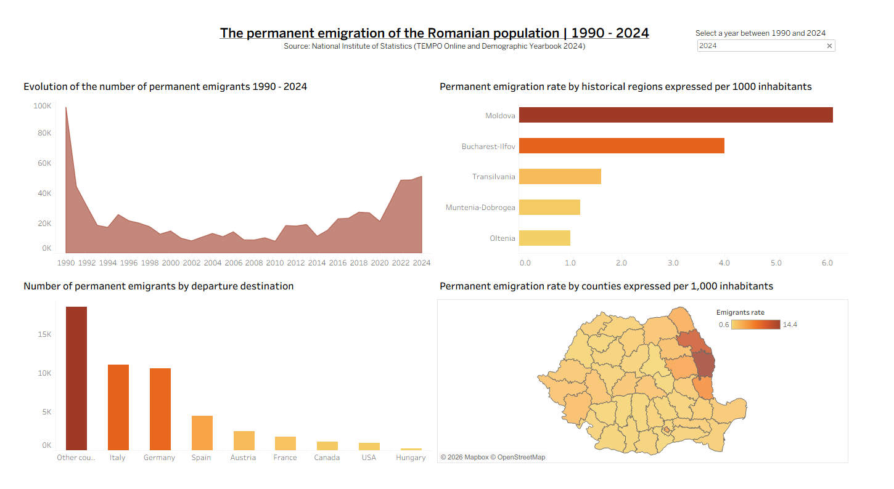

# Analysis of Permanent Emigration of the Romanian Population (1990-2024)

This project analyzes the evolution of permanent emigration from Romania over three decades,
using official data from the INS (TEMPO Online and Demographic Yearbook from 2024). The project includes data processing
in Python and interactive visualization in Tableau.

**[👉 View the Dashboard on Tableau Public](https://public.tableau.com/app/profile/vlad.pirvan/viz/PermanentEmigrationfromRomania1990-2024/Dashboard1?publish=yes)**

**Phase 1: Data Acquisition & Preprocessing (Python)**

The analysis is based on two main sources from the National Institute of Statistics (INS): the TEMPO Online database and the 2024 Demographic Yearbook.

In the Folder data:

    Folder raw/: Contains the original datasets.

    Folder data_processed/: Contains cleaned Excel outputs as a result of processing using python.
    
In the Folder notebook:

   The entire analytical foundation for the Tableau dashboard was built using Python within Jupyter Notebooks, primarily leveraging the Pandas and NumPy libraries:
     Comprehensive Time-Series: The processing covers the full 1990–2024 period, enabling the global year filter seen in Dashboard.
     Data Aggregation: Performed data grouping and aggregations to transform raw county-level records into the regional and destination-based insights shown in the charts.
     Normalization: Calculated the Emigration Rate per 1,000 inhabitants. This was crucial for the map and regional bar charts to ensure a fair comparison between areas with different population densities.
     Data Cleaning: Standardized country names (for the "Departure Destination" chart) and handled historical data inconsistencies to ensure a smooth trend line across three decades.

**Phase 2: Geographic Data Preparation (GIS)**

To create the map visualization in the dashboard, I processed spatial data that can be found in the dedicated data/shapefiles folder:

    Source: Downloaded the Romanian county shapefiles from geo-spatial.org.

    Refinement: Used GeoDA to prune unnecessary columns and optimize the shapefile for performance.

    Integration: The refined shapefile (stored in the shapefiles/ folder) was joined with the processed emigration data in Tableau using county codes as the common key.

**Phase 3: Interactive Visualization (Tableau)**

The final dashboard provides a multi-perspective view of Romanian emigration:

    Evolution (1990-2024): A shaded area chart highlighting historical peaks.

    Regional Disparities: A bar chart showing that the Moldova region often records the highest emigration rates in recent years.

    Destination Analysis: Identification of Italy, Germany, and Spain as top destinations.

    Spatial Distribution: A map showing emigration intensity by county.

**Other repository content**

-Permanent Emigration from Romania 1990-2024.twbx: The Tableau source file (Packaged Workbook) containing both the data and the visualization.

-VladPIRVAN_CV_dashboard.png: Picture of the dashboard.
