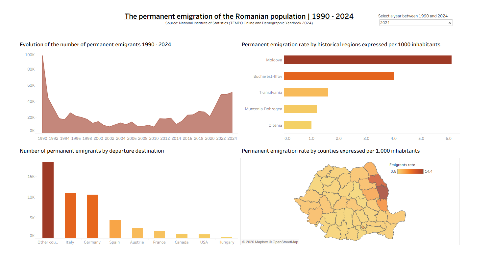

# Emigration-from-Romania-1990-2024-Personal-Project
Emigration from Romania 1990 - 2024

# Analysis of Permanent Emigration of the Romanian Population (1990 - 2024)

This project analyzes the evolution of permanent emigration from Romania over three decades,
using official data from the INS (TEMPO Online and Demographic Yearbook from 2024). The project includes data processing
in Python and interactive visualization in Tableau.

**[👉 View the Dashboard on Tableau Public](https://public.tableau.com/app/profile/vlad.pirvan/viz/EmigrationfromRomania1990-2024/Dashboard1)**

